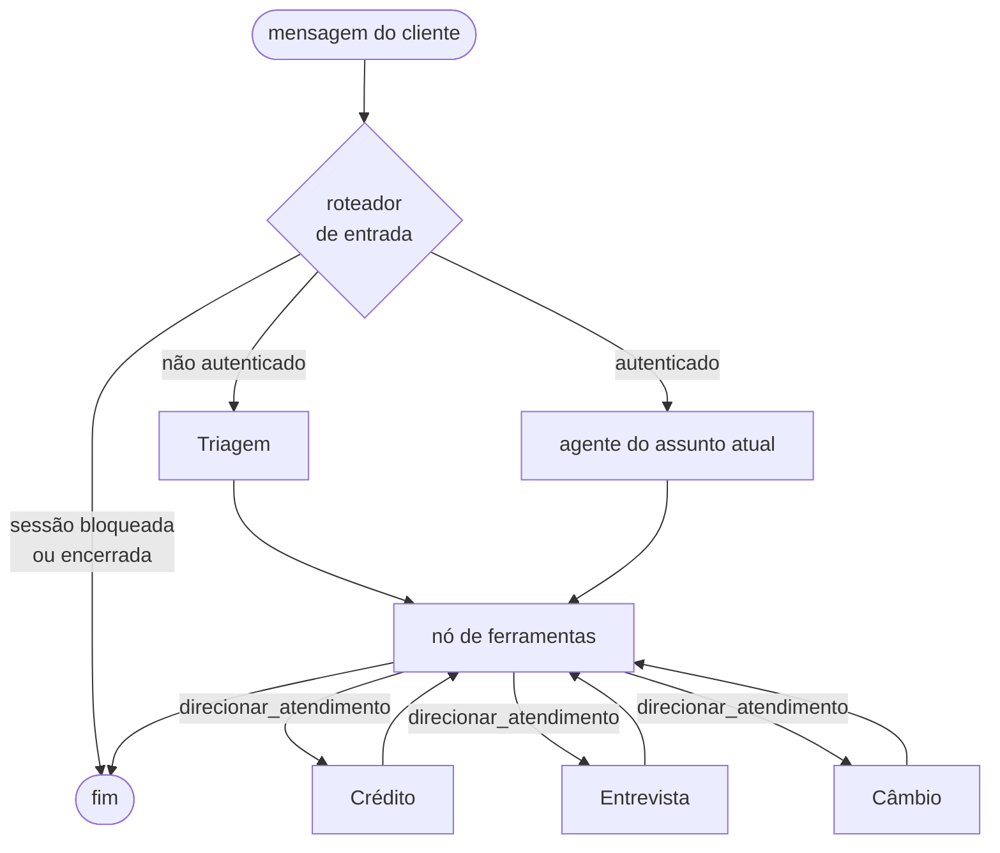

# 🏦 Banco Ágil — atendimento bancário multiagente

[](https://github.com/Leopcmelo/banco-agil/actions/workflows/ci.yml)

Sistema de atendimento ao cliente para um banco digital fictício, construído
com quatro agentes de IA especializados que, para o cliente, se comportam como
**um único atendente**.

---

## Visão geral

O cliente conversa por uma interface de chat. Por baixo, quatro agentes se
revezam conforme o assunto, sem que a troca seja perceptível:

| Agente | Papel |
|---|---|
| **Triagem** | Recepciona, autentica com CPF + data de nascimento e identifica o assunto. |
| **Crédito** | Consulta limite, registra o pedido formal de aumento e comunica a decisão. |
| **Entrevista de Crédito** | Conduz a entrevista financeira e recalcula o score. |
| **Câmbio** | Consulta cotação de moeda em API externa. |

O princípio que organiza o projeto inteiro:

> **O LLM conversa. O código decide.**

Score, aprovação de limite, contagem de tentativas de autenticação e leitura de
faixas são funções Python puras, testadas isoladamente. O modelo apenas coleta
o que o cliente diz e verbaliza o que o código devolve. Ele nunca soma, nunca
compara e nunca decide.

---

## Arquitetura

### Camadas

```
app.py                    UI Streamlit — só apresentação e cache de tela
   │
   ▼
src/agents/               Os quatro agentes + o grafo que os costura
   │  grafo.py            StateGraph, roteamento e transferência implícita
   │  prompts/*.md        Instruções em arquivo, nunca hardcoded
   ▼
src/tools/                Wrappers finos: validam, chamam, devolvem dict
   │                      É AQUI que a autenticação é verificada
   ▼
src/core/                 Regra de negócio pura — sem I/O, sem LLM, 100% testada
   │  score.py            Cálculo do score
   │  limites.py          Faixa de score → limite, e a decisão aprovado/rejeitado
   │  validadores.py      CPF, data e valor monetário
   ▼
src/data/repositories.py  Única porta de entrada para os CSVs
```

A dependência aponta sempre para dentro: `core` não conhece ninguém, `tools`
conhece `core` e `data`, `agents` conhece `tools`. `core` pode ser importado e
testado sem instalar LangChain e sem chave de API.

### O grafo



O roteador de entrada é **uma função Python**, não um agente. Ele lê o
`SessionState` e decide: sem autenticação, só a Triagem roda; com a sessão
bloqueada, nada roda. Não existe um quinto agente nem um orquestrador — o grafo
é a costura, e cada nó é um dos quatro agentes do enunciado.

### Transferência implícita

O agente ativo chama a tool interna `direcionar_atendimento`. O nó de
ferramentas percebe a chamada e troca o agente ativo. A única saída visível é
uma `ToolMessage`, que a UI não exibe — nenhuma mensagem é gerada pela
transferência em si.

Isso é reforçado em três frentes:

1. Os prompts proíbem explicitamente anunciar transferência, se reapresentar,
   cumprimentar duas vezes ou pedir um dado já fornecido.
2. Sub-agentes não têm as tools uns dos outros — o Câmbio não alcança nada de
   crédito, e há teste para isso.
3. Um teste varre as falas em busca de marcas como "vou te transferir",
   "setor", "especialista".

### Como os dados são manipulados

Três CSVs, todos acessados exclusivamente por `src/data/repositories.py`:

**`data/clientes.csv`** (leitura e escrita)

| coluna | tipo | observação |
|---|---|---|
| `cpf` | str | 11 dígitos, zeros à esquerda preservados |
| `nome` | str | |
| `data_nascimento` | str | ISO `YYYY-MM-DD` |
| `limite_atual` | float | |
| `score` | int | 0–1000, atualizado pela entrevista |

**`data/score_limite.csv`** (somente leitura) — `score_min`, `score_max`,
`limite_maximo`. Faixas contíguas, sem buraco e sem sobreposição, inclusivas
nos dois lados. A validação roda no carregamento: um score sem faixa vira
exceção, jamais uma aprovação silenciosa.

**`data/solicitacoes_aumento_limite.csv`** (append) — `cpf_cliente`,
`data_hora_solicitacao`, `limite_atual`, `novo_limite_solicitado`,
`status_pedido`.

O pedido é **sempre gravado como `pendente` primeiro** e só depois transiciona
para `aprovado` ou `rejeitado`. O enunciado pede o registro do pedido formal
antes da checagem de score; gravar já decidido perderia a trilha de auditoria.

Toda escrita é atômica: arquivo temporário no mesmo diretório, `fsync`, e
`os.replace`. Um crash no meio da gravação deixa o arquivo antigo intacto, não
truncado. Há um lock de processo porque o Streamlit re-executa o script a cada
interação.

### Fluxo principal

```
Cliente: "oi"
  → Triagem cumprimenta e pede o CPF
  → pede a data de nascimento
  → autenticar_cliente()  ← quem valida é o código, não o modelo

Cliente: "quero aumentar meu limite para 3000"
  → direcionar_atendimento(credito)          [invisível]
  → solicitar_aumento_limite("3000")
       grava pendente → avalia score → transiciona para rejeitado
  → "Não consegui aprovar esse valor. Posso fazer algumas perguntas rápidas?"

Cliente: "pode"
  → direcionar_atendimento(entrevista)       [invisível]
  → cinco perguntas, uma por vez
  → finalizar_entrevista()  → score recalculado e persistido
  → direcionar_atendimento(credito)          [invisível]
  → solicitar_aumento_limite("3000") → agora aprovado
```

---

## Funcionalidades implementadas

**Triagem**
- Saudação, coleta de CPF e data de nascimento em qualquer formato
  (`005.534.793-26` ou `00553479326`; `14/03/1988` ou `1988-03-14`)
- Autenticação contra `clientes.csv` com validação de dígito verificador
- Máximo de 3 tentativas; ao esgotar, a sessão é bloqueada e **todas** as
  tools passam a recusar
- Identificação do assunto e direcionamento

**Crédito**
- Consulta de limite atual
- Registro do pedido formal em CSV, sempre como `pendente` primeiro
- Decisão aprovado/rejeitado pela faixa de score
- Aplicação do novo limite quando aprovado
- Oferta da entrevista quando rejeitado, sem insistir se o cliente recusar
- Consulta de histórico de solicitações

**Entrevista**
- Cinco perguntas, uma por vez, aceitando resposta em linguagem natural
  ("uns 8 mil", "CLT", "não tenho nenhuma")
- Respostas parciais acumuladas; uma resposta inválida não descarta as demais
- Recálculo do score e persistência em `clientes.csv`
- Devolução ao Crédito para nova análise

**Câmbio**
- Cotação de dólar, euro, libra, iene e outras, com fallback entre duas fontes
- Não exige autenticação — cotação é informação pública

**Transversal**
- Encerramento por pedido do cliente, a qualquer momento
- Tratamento controlado de erro em toda camada: CSV ausente, API fora do ar,
  entrada inválida, tool alucinada pelo modelo
- Logging estruturado com CPF mascarado (`***.***.793-26`)
- UI Streamlit com inspeção dos CSVs e botão de reset

---

## Desafios enfrentados e como foram resolvidos

### 1. A fórmula do score não cabe em 0–1000

O enunciado define score de 0 a 1000, mas a fórmula é ilimitada. Com
`renda=15000` e `despesas=0`, o resultado é **450.000**. Com renda zero,
desempregado, 3+ dependentes e dívidas ativas, é **−70**.

Três ajustes, documentados como ADR-001:

- **Teto de 500 no componente de renda.** A soma máxima dos componentes fixos
  também é 500 (300 formal + 100 sem dependentes + 100 sem dívidas), então o
  máximo teórico passa a ser exatamente 1000, sem teto artificial no total.
- **Clamp em [0, 1000]** depois da soma.
- **Multiplicação antes da divisão** — `(renda * 30) / (despesas + 1)` —
  matematicamente idêntico, numericamente estável na fronteira do teto.

Também troquei o `round()` nativo por half-up explícito: o Python usa
*banker's rounding*, em que `round(0.5) == 0`. Num score de crédito isso é
surpresa desnecessária.

**Limitação conhecida:** perfis realistas ficam na faixa 450–620, porque
atingir o teto de renda exige razão renda/despesa de ≈ 16,7. Isso é
consequência da fórmula do enunciado, não um bug — foi mantida por fidelidade
ao escopo. Uma curva log-saturada seria a evolução natural.

### 2. Zeros à esquerda no CPF

`pd.read_csv` sem `dtype=str` transforma `00553479326` no inteiro `553479326`.
A autenticação passaria a falhar **silenciosamente** para todo cliente cujo CPF
começa com zero — uma parcela real da base, e um bug que só aparece em
produção.

A resolução foi tratar isso como invariante e não como cuidado pontual: leitura
sempre com `dtype=str`, escrita sempre como texto, e dois CPFs iniciados em `0`
plantados nos dados semente para que o teste de round-trip exercite o caminho
de verdade.

### 3. Provar que a transferência é imperceptível

Este é o requisito mais difícil de testar, porque o texto vem do modelo.

O que **não** funciona: escrever um teste que verifica a fala do LLM contra uma
lista de frases proibidas. Com roteiro fixo, o teste verifica o próprio roteiro
— é circular. Com o modelo real, é não determinístico e não roda em CI.

O que foi feito em vez disso, atacando o problema pelas bordas determinísticas:

- **Escopo por construção** — cada agente só recebe as tools do seu domínio.
  O de Câmbio não tem como falar de limite porque não alcança a tool.
- **Zero mensagem na transferência** — teste que verifica que a troca de agente
  produz exatamente uma `ToolMessage` e nenhuma fala.
- **Prompts sob teste** — testes que falham se as proibições sumirem do prompt
  comum, ou se a fórmula do score e as faixas de limite vazarem para dentro
  dele.
- **Varredura reutilizável** — `marcas_de_transferencia()` é pública e serve
  tanto para os testes com roteiro quanto para auditar uma conversa real.

### 4. Um bug de sinal que quase passou

O parser de valor monetário aceita linguagem natural ("R$ 12 mil", "5k",
"1.234,56"). Ele limpava a entrada com `re.sub(r"[^0-9.,]", "", texto)` — o que
descartava o sinal de menos junto com a pontuação. `"-500"` virava `500.0` e
era aceito como positivo.

O teste que pegou isso esperava rejeição com uma mensagem; a correção foi
detectar o sinal **antes** de limpar a pontuação. Vale registrar que a tentação
aqui era ajustar o teste, e não o código.

### 5. Ambiguidade `rejeitado` vs `reprovado`

O enunciado usa `'rejeitado'` na definição da coluna e `'reprovado'` no texto
corrido. Adotei **`rejeitado`** como valor canônico (ADR-002), com domínio
fechado `{pendente, aprovado, rejeitado}` validado no modelo. `reprovado` não
existe em lugar nenhum do código.

### 6. Streamlit re-executa o script inteiro

A cada interação, o script roda do começo. Isso quebra duas coisas de forma
sutil: os handlers de log se acumulam e cada linha sai duplicada; e escritas
concorrentes podem duplicar ou perder linha no CSV.

Resolvido com configuração idempotente de logging (com teste que verifica que
a mensagem aparece **uma** vez após três configurações) e lock de processo na
camada de repositório (com teste de 20 threads gravando em paralelo).

---

## Escolhas técnicas e justificativas

### LangGraph

O requisito de transferência implícita é, na prática, um problema de máquina de
estados: quem atende, quando troca, e o que continua valendo depois da troca.
LangGraph modela isso como grafo explícito, o que deixou o roteamento em código
inspecionável em vez de emergente do prompt.

CrewAI foi descartado por ser orientado a delegação verbosa entre papéis, que
briga com o requisito de transição imperceptível. Google ADK tem handoff nativo,
mas menos controlável e mais difícil de testar sem chave.

### Dois provedores: Anthropic e Google

A escolha de modelo é de **operação, não de arquitetura**. `criar_llm()` lê
`BANCO_AGIL_PROVEDOR` e devolve um `BaseChatModel`; o grafo, os agentes e as
tools não sabem qual está atrás. Trocar de provedor é uma linha no `.env`.

| Provedor | Padrão | Observação |
|---|---|---|
| `anthropic` | `claude-opus-5` | Raciocínio ligado por padrão; recusa `temperature` com 400 |
| `google` | `gemini-3.6-flash` | Free tier sem cartão; ignora `temperature` |

A escolha do modelo Gemini foi corrigida durante a integração:
`gemini-2.5-flash` não está mais disponível para novos usuários e responde 404
recomendando o 3.6. Os modelos `gemini-3.7-flash` e `gemini-flash-latest`
responderam 503 por demanda alta no momento do teste.

**Temperatura não é enviada por padrão**, e isso é deliberado: a família
gemini-3.x ignora o parâmetro e emite aviso a cada chamada, enquanto o Claude
Opus 5 recusa a requisição inteira com 400. Mandar só quando o operador pediu
resolve os dois casos. Para quem apontar o projeto para um modelo que aceite
amostragem, a temperatura baixa continua fazendo sentido: o agente conversa,
quem decide é o código, e criatividade ali só produziria número inventado.

**`max_tokens` é folgado (8192) de propósito.** Nos modelos com raciocínio
ligado por padrão, esse teto limita o raciocínio *e* o texto juntos — um valor
apertado trunca a resposta no meio.

### AwesomeAPI para câmbio, não busca web

O enunciado sugere Tavily ou SerpAPI. Descartei ambas (ADR-005): busca web é
lenta e não determinística para um número que precisa estar **correto**. A
AwesomeAPI é gratuita, sem chave, devolve JSON direto e tem latência baixa.
`open.er-api.com` é o fallback. Timeout de 5s e 1 retry por fonte.

### A fronteira com o LLM é toda de texto

Os parâmetros das tools são `str`, mesmo para valores numéricos. A conversão
acontece dentro do código, com os mesmos normalizadores usados no cálculo.

Duas razões: o schema de função do Gemini lida melhor com tipo simples do que
com união anulável; e é onde a linguagem natural do cliente ("uns 8 mil")
precisa virar dado canônico de qualquer forma. Deixar o modelo fazer essa
conversão seria delegar interpretação numérica a quem não deve fazê-la.

### Tools devolvem `dict`, nunca objeto de domínio

Formato uniforme `{"status", "dados", "mensagem"}`. Objeto de domínio não
serializa para a conversa, e o formato fixo permite ao prompt instruir sobre
`status: "erro"` de forma genérica.

### Autenticação verificada em código, não em prompt

Um decorator `@exige_sessao_ativa` consulta o objeto de sessão. Mesmo que o
prompt seja manipulado a afirmar que o cliente já está autenticado, a tool
recusa. Há teste que força o estado do grafo para o agente de Crédito sem
autenticar e verifica que a tool devolve `nao_autenticado`.

A mensagem de falha nunca revela **qual** campo errou: dizer "o CPF existe mas
a data não confere" entregaria de graça a validade de um CPF. Há teste
comparando as duas mensagens.

### Mascaramento de CPF por filtro, não por chamada

O filtro age na mensagem já formatada no logger. Confiar em cada `logger.info`
lembrar de mascarar é frágil; um filtro pega também o que passou despercebido.

Efeito colateral aceito: timestamps ISO nos logs viram `<data-oculta>`, porque
o regex não distingue data de nascimento de data qualquer. A trilha de auditoria
vive no CSV, não no log.

---

## Tutorial de execução e testes

### Pré-requisitos

- Python 3.11 ou superior
- Uma chave de API de um dos dois provedores:
  - **Anthropic** — [console.anthropic.com](https://console.anthropic.com/settings/keys).
    Gere uma chave **de workspace**: uma chave vinculada à identidade exige o
    header `anthropic-workspace-id` em toda chamada (o projeto suporta isso via
    `ANTHROPIC_WORKSPACE_ID`, mas a chave de workspace é mais simples).
  - **Google Gemini** — gratuita em
    [aistudio.google.com/apikey](https://aistudio.google.com/apikey)

### Instalação

```bash
git clone <url-do-repositorio>
cd banco_agil

python3 -m venv .venv
source .venv/bin/activate          # Windows: .venv\Scripts\activate

pip install -r requirements.txt
```

### Configuração

```bash
cp .env.example .env
```

Abra o `.env`, escolha `BANCO_AGIL_PROVEDOR` e preencha a chave correspondente
(`ANTHROPIC_API_KEY` ou `GOOGLE_API_KEY`). Os demais valores têm padrão
razoável — em especial, deixe `BANCO_AGIL_TEMPERATURA` **vazio**.

### Executando

```bash
streamlit run app.py
```

A aplicação abre em `http://localhost:8501`.

Se a chave não estiver configurada, a interface sobe assim mesmo e mostra
exatamente o que falta — em vez de um stack trace.

### Clientes para teste

A barra lateral mostra a tabela completa. Alguns perfis úteis:

| Nome | CPF | Nascimento | Limite | Score | Serve para testar |
|---|---|---|---|---|---|
| Ana Beatriz Cardoso | `005.534.793-26` | 14/03/1988 | R$ 8.000 | 720 | Aumento aprovado até R$ 15.000 |
| Giovana Sarti | `975.524.877-39` | 17/12/1984 | R$ 300 | 150 | Rejeição → entrevista → aprovação |
| Carla Menezes Ribeiro | `398.193.919-03` | 30/07/1979 | R$ 20.000 | 890 | Faixa mais alta |
| Bruno Nakamura | `010.746.591-47` | 02/11/1995 | R$ 2.500 | 610 | CPF com zero à esquerda |

### Roteiro de teste sugerido

1. **Autenticação** — dê o CPF e a data da Giovana.
2. **Rejeição** — "quero aumentar meu limite para 3000". O pedido é registrado
   e rejeitado (o teto da faixa dela é bem menor).
3. **Entrevista** — aceite a oferta. Responda: renda 9000, CLT, despesas 1000,
   0 dependentes, sem dívidas.
4. **Aprovação** — o score sobe e o mesmo pedido passa. Confira em
   **Solicitações**, na barra lateral: duas linhas, uma `rejeitado` e outra
   `aprovado`.
5. **Câmbio** — "qual a cotação do euro?".
6. **Bloqueio** — em **Nova conversa**, erre a data três vezes seguidas.
7. **Reset** — o botão **Resetar dados** devolve tudo ao estado inicial.

### Testes

```bash
pytest -q
```

Rodam offline e sem chave de API: o modelo é substituído por um dublê
roteirizado e as chamadas HTTP de câmbio por respostas fixas.

```bash
pytest -q tests/test_score.py       # o motor de score, isolado
pytest -q tests/test_grafo.py       # roteamento e conversa
pytest --cov=src                    # com cobertura (requer pytest-cov)
```

O que a suíte cobre, por camada:

| Arquivo | Foco |
|---|---|
| `test_score.py` | Fórmula, teto, clamp, monotonicidade, normalização |
| `test_limites.py` | Faixas, bordas inclusivas, decisão aprovado/rejeitado |
| `test_validadores.py` | CPF, data, valor monetário em linguagem natural |
| `test_repositories.py` | Round-trip CSV, escrita atômica, concorrência |
| `test_session.py` | Autenticação e contagem de tentativas |
| `test_logging_config.py` | Mascaramento de CPF e data |
| `test_cambio_api.py` | Retry, fallback, erro de rede |
| `test_tools.py` | Recusas por não-autenticado e por bloqueio |
| `test_grafo.py` | Escopo dos agentes, roteamento, fluxo completo |

Uma nota honesta sobre o alcance: os testes de conversa usam um LLM roteirizado,
então verificam o que é determinístico — roteamento, autorização, fiação das
tools e persistência. O comportamento textual do Gemini em si não é coberto por
teste automatizado; a defesa ali são os prompts e o isolamento de escopo por
construção.

### Qualidade

```bash
ruff check src tests app.py
black --check src tests app.py
```

---

## Decisões arquiteturais

As ambiguidades do enunciado foram resolvidas explicitamente e estão
documentadas como ADRs no [`CLAUDE.md`](CLAUDE.md):

| ADR | Assunto |
|---|---|
| ADR-001 | Normalização da fórmula de score |
| ADR-002 | `rejeitado` como valor canônico |
| ADR-003 | 3 tentativas de autenticação no total |
| ADR-004 | Transferência implícita entre agentes |
| ADR-005 | AwesomeAPI como fonte de cotação |
| ADR-006 | Persistência em CSV com lock e escrita atômica |

---

## Estrutura do projeto

```
banco_agil/
├── app.py                        UI Streamlit
├── requirements.txt
├── CLAUDE.md                     Regras do projeto e ADRs
├── data/
│   ├── clientes.csv
│   ├── score_limite.csv
│   ├── solicitacoes_aumento_limite.csv
│   └── seed/                     Cópia imutável para o botão de reset
├── docs/
│   └── desafio-tecnico.pdf       Enunciado original
├── src/
│   ├── core/                     Regra de negócio pura
│   ├── data/                     Modelos e repositório
│   ├── agents/                   Os quatro agentes, o grafo e os prompts
│   ├── tools/                    Wrappers entre agentes e regras
│   ├── services/                 Cliente HTTP de câmbio
│   ├── session.py
│   └── logging_config.py
└── tests/
```
